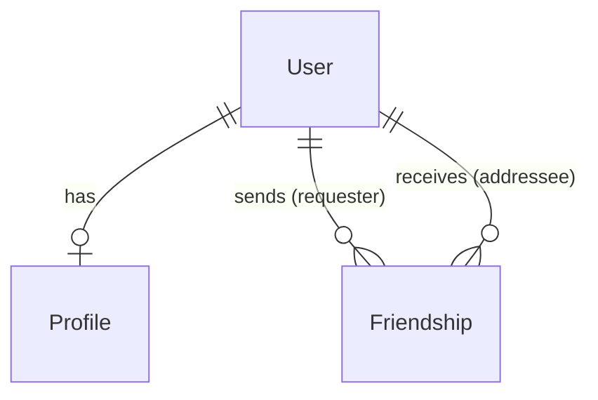

# User Management Service Architecture

## Overview

The User Management Service is a Node.js/TypeScript REST API built with Fastify framework that handles user authentication, profile management, and friendship relationships for the Transcendence project. The service follows a layered architecture pattern with clear separation of concerns.

## Technology Stack

- **Runtime**: Node.js with TypeScript
- **Web Framework**: Fastify
- **Database**: SQLite with Prisma ORM
- **Authentication**: Two-Factor Authentication (2FA) with TOTP
- **Password Security**: bcrypt hashing
- **File Handling**: Multipart support for avatar uploads
- **Environment**: Docker containerized

## Architecture Pattern

The service follows a **3-layer architecture**:

```
┌─────────────────┐
│   Controllers   │  ← HTTP Request/Response handling
├─────────────────┤
│    Services     │  ← Business logic
├─────────────────┤
│   Data Layer    │  ← Database operations (Prisma)
└─────────────────┘
```

## Module Responsibilities Overview

Understanding the role of each component in our RESTful API is crucial for maintaining clean, scalable code. Here's what each module is responsible for and why this separation matters:

### Routes (`/routes`)
**What they do**: Define the API endpoints and map HTTP methods to controller functions.
**Responsibility**: 
- URL pattern definition (`GET /users/:username`)
- HTTP method mapping (`POST`, `GET`, `PUT`, `DELETE`)
- Route grouping and organization
- Middleware attachment at route level

**Why separate**: Routes are the "entry points" to your API. By keeping them separate, we can easily see all available endpoints at a glance and modify URL structures without touching business logic.

**Example**: 
```typescript
// routes/user.route.ts
fastify.get("/:username", userController.getByUsername);
fastify.put("/:username", userController.updateUser);
```

### Controllers (`/controllers`)
**What they do**: Handle HTTP-specific concerns and orchestrate the request/response cycle.
**Responsibility**:
- Extract data from HTTP requests (body, params, headers)
- Input validation and sanitization
- Call appropriate service methods
- Format responses and set HTTP status codes
- Handle HTTP-specific errors (400, 401, 404, etc.)
- File upload processing

**Why separate**: Controllers are the "translators" between HTTP and your business logic. They handle all the web-specific stuff so your business logic stays pure and testable.

**Example**:
```typescript
// controllers/user.controller.ts
export const getByUsername = async (req: FastifyRequest, res: FastifyReply) => {
  const { username } = req.params; // Extract from HTTP request
  const user = await userService.findUserByUsername(username); // Call business logic
  return res.code(200).send(user); // Format HTTP response
};
```

### Services (`/services`)
**What they do**: Contain the core business logic and rules of your application.
**Responsibility**:
- Business rule enforcement (password validation, user permissions)
- Data processing and transformation
- Complex operations that involve multiple data entities
- Integration with external services (2FA, email)
- Business-specific error handling
- Transaction management

**Why separate**: Services are the "brain" of your application. They contain the actual business rules and can be reused across different interfaces (HTTP API, CLI tools, background jobs).

**Example**:
```typescript
// services/user.service.ts
async createUser(username: string, password: string) {
  // Business rule: validate password strength
  const result = this.pwValidator.validate(password);
  if (!result.valid) throw new UserServiceError(...);
  
  // Business logic: hash password
  const hashedPassword = await bcrypt.hash(password, 10);
  
  // Delegate data persistence to data layer
  return prisma.user.create({...});
}
```

### Interfaces (`/interfaces`)
**What they do**: Define TypeScript types and contracts for data structures.
**Responsibility**:
- Type definitions for entities (User, Profile, Friendship)
- API request/response schemas
- Service method contracts
- Ensure type safety across the application

**Why separate**: Interfaces are the "contracts" of your application. They ensure everyone agrees on data shapes and catch errors at compile time.

**Example**:
```typescript
// interfaces/user.interface.ts
export interface User {
  id: string;
  username: string;
  email?: string;
  // ... other properties
}
```

### Lib (`/lib`)
**What they do**: Provide shared utilities and external service configurations.
**Responsibility**:
- Database client initialization (Prisma)
- External service clients (Redis, email services)
- Shared utility functions
- Configuration management

**Why separate**: Lib modules are the "infrastructure" pieces that multiple parts of your app need. Centralizing them prevents duplication and makes configuration changes easier.

**Example**:
```typescript
// lib/prisma.ts
import { PrismaClient } from "../../generated/prisma";
const prisma = new PrismaClient(); // Single database connection
export default prisma;
```

## Why This Separation Matters

### 1. **Single Responsibility Principle**
Each module has one clear job, making code easier to understand and modify.

### 2. **Testability**
- Controllers can be tested for HTTP handling
- Services can be unit tested without HTTP concerns
- Business logic is isolated and easily mockable

### 3. **Reusability**
- Services can be used by different controllers
- Same business logic can serve HTTP API, CLI tools, or background jobs

### 4. **Maintainability**
- Changes to URL structure only affect routes
- Business rule changes only affect services
- Database changes only affect data layer

### 5. **Team Collaboration**
- Frontend developers can understand API contracts from routes/controllers
- Backend developers can focus on business logic in services
- DevOps can understand deployment needs from app.ts and server.ts

## Project Structure

```
src/
├── app.ts                 # Fastify application setup
├── server.ts              # Server entry point & lifecycle management
├── controllers/           # HTTP request handlers
├── services/              # Business logic layer
├── routes/                # Route definitions
├── interfaces/            # TypeScript type definitions
└── lib/                   # Shared utilities (Prisma client)
```

## Core Components

### 1. Application Layer (`app.ts`)

- **Fastify Instance**: Configured with environment-based logging
- **Middleware Registration**: Multipart file upload support
- **Route Registration**: Modular route mounting with prefixes
- **Health Check**: Basic health endpoint

### 2. Database Layer

#### Prisma Schema Design

The database consists of three main entities:

**User Entity**:
- Primary identifier: UUID
- Authentication: username/password + optional 2FA
- Audit fields: createdAt, updatedAt
- Status: active flag for soft deletion

**Profile Entity**:
- One-to-one relationship with User
- Rich metadata: avatar, bio, status, language preferences
- User presence: ONLINE, OFFLINE, IN_GAME

**Friendship Entity**:
- Many-to-many relationship between Users
- Status tracking: PENDING, ACCEPTED, BLOCKED, DECLINED
- Role-based permissions (ADMIN, USER)

#### Relationships



### 3. Service Layer

#### User Service
- **Authentication**: Login with optional 2FA
- **User Management**: CRUD operations
- **2FA Management**: Secret generation, QR codes, enable/disable
- **Password Security**: Validation and hashing

#### Profile Service
- **Profile Management**: Create, read, update, delete
- **Avatar Handling**: Upload, storage, retrieval with type validation
- **Status Management**: Online presence tracking

#### Friendship Service
- **Relationship Management**: Send/accept/decline friend requests
- **Friend Lists**: Retrieve user connections
- **Blocking**: User blocking functionality

### 4. Controller Layer

Controllers handle HTTP-specific concerns:
- Request validation
- Response formatting
- Error handling and HTTP status codes
- File upload processing

## Security Features

### Authentication Security
- **Password Validation**: Enforced complexity requirements
- **Password Hashing**: bcrypt with salt rounds
- **Two-Factor Authentication**: TOTP-based 2FA support
- **Input Validation**: Request validation at controller level

### File Upload Security
- **File Type Validation**: Only JPEG, PNG, GIF allowed
- **Size Limits**: 2MB maximum file size
- **MIME Type Checking**: Server-side content verification

## Error Handling

### Custom Error Classes
- `UserServiceError`: User-specific business logic errors
- `ProfileServiceError`: Profile-related errors
- `FriendshipServiceError`: Friendship operation errors

### HTTP Status Codes
- `200`: Success
- `201`: Created
- `400`: Bad Request (validation errors)
- `401`: Unauthorized (2FA required)
- `403`: Forbidden (invalid credentials)
- `404`: Not Found
- `413`: Payload Too Large
- `415`: Unsupported Media Type
- `500`: Internal Server Error

## Data Validation

### Password Requirements
- Minimum 8 characters, maximum 20
- Must contain uppercase and lowercase letters
- Must contain numbers and special characters
- Combined error reporting

### File Validation
- Image files only (JPEG, PNG, GIF)
- Maximum 2MB size limit
- MIME type verification

## Database Migrations

Prisma manages database schema evolution with migration files:
- `20250603143102_init` - Initial schema
- `20250603203214_profile_model_creation` - Profile entity
- `20250603203349_2_fa` - Two-factor authentication
- `20250603204935_user_profile_friendship_setup` - Relationships
- `20250610112648_use_username_relations` - Username-based relations
- `20250619161853_avatar` - Avatar support
- `20250622144933_roles` - Role-based permissions
- `20250624200338_not_unique_email` - Email constraint updates

## Environment Configuration

### Required Environment Variables
- `DATABASE_URL`: SQLite database file path
- `NODE_ENV`: Environment (development/production/test)
- `PORT`: Server port (default: 3000)
- `HOST`: Server host (default: 0.0.0.0)

### Logging Configuration
- **Development**: Pretty-printed logs with timestamps
- **Production**: JSON structured logging
- **Test**: Logging disabled

## Deployment

### Docker Support
- Dockerfile present for containerization
- Multi-stage build for optimized production images
- Environment-based configuration

### Process Management
- Graceful shutdown handling (SIGINT)
- Database connection cleanup
- Resource management

## Scalability Considerations

### Database
- SQLite suitable for development/small deployments
- Easy migration path to PostgreSQL/MySQL for production
- Indexed foreign key relationships for performance

### Stateless Design
- No session state stored in application
- Horizontal scaling ready
- Load balancer compatible

## Development Workflow

### Build Process
- `npm run dev`: Development server with hot reload
- `npm run build`: TypeScript compilation
- `npm start`: Production server

### Database Management
- Prisma Studio for data visualization
- Migration generation and application
- Schema drift detection

This architecture provides a solid foundation for user management in the Transcendence project, with clear separation of concerns, robust error handling, and security best practices.
